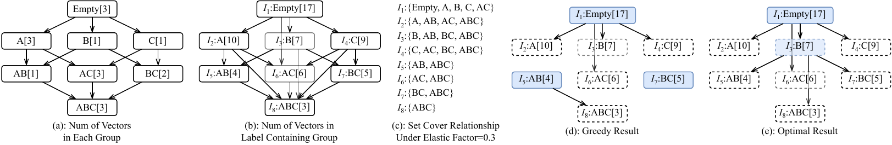
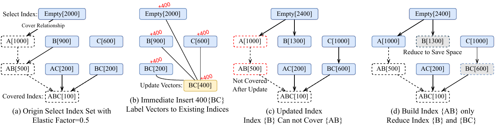
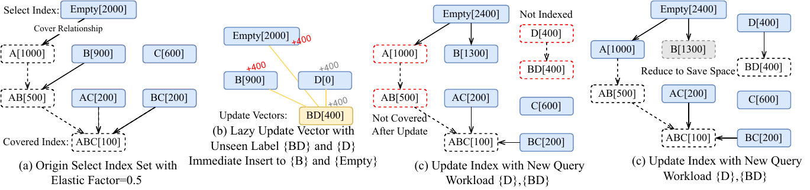

# Elastic Label Index: Efficient Approximate Nearest Neighbor Search with Label Selected

This is the official implementation of the paper Elastic Label Index: Efficient Approximate Nearest Neighbor Search with Label Selected.
ELI selectively indexing only a subset of query-label sets while still ensuring efficient processing for all
queries. We prove the problem is NP-complete and propose efficient greedy algorithms for its efficiency- and space-constrained variants. Extensive
experiments on real-world datasets show that our method achieves
10×–800× speedups over state-of-the-art techniques.

## Requirement
* C++
  * Cmake
  * OpenMP
  * Boost
* Hardware Support
  * AVX512
  * AVX
  * SSE

## Repository Structure
```
.
├── CMakeLists.txt
├── README.md
├── figure
│   ├── Example.png
│   ├── dynamic.png
│   └── unseen.png
├── include                     # ELI source codes
├── mkdir.sh
├── run.sh
├── script                      # test script
├── set.sh
├── technical_report.pdf
├── test                        # C++ codes for the test script
└── tools                       # util functions to generate labels and compute groundtruth
```

## Reproduction
1. set the `store_path` and `datasets`, `labelsets` variables in set.sh. 
    `store_path` is the path to store the dataset, `datasets` is the list of dataset names, `labelsets` is the list of label set names. 
    You can generate labelset of `multi_normial/zipf/uniform/poisson/one_per_point` distribution by `script/pre_process.sh`, 
    but you can also provide your own label files.
2. Prepare the dataset (format specified below) and label files.
3. Run `bash run.sh`. Refer to docs in the scripts for more options.

## Data Path
1. All dataset store in fvecs format or bin format.
2. The dataset path needs to be arranged as
```
{store_path}/{dataset_name}/
    -- {dataset_name}_base.[bin]&[fvecs]
    -- {dataset_name}_query.[bin]&[fvecs]
    -- {dataset_name}_base_{number_of_labels}_labels_[distribution].txt    
    -- {dataset_name}_query_{number_of_labels}_labels_[distribution]_[scenario].txt  # available scenarios: containment/equality/overlap/nofilter
```
   
Example:
```
./DATA
├── sift
│   ├── sift_base.fvecs
│   ├── sift_query.fvecs
│   ├── sift_base_12_labels_zipf.txt                 # generated by script/pre_process.sh or your own label file
│   └── sift_query_12_labels_zipf_containment.txt
```

## Example of Index Selection


## Example of Dynamic Index




